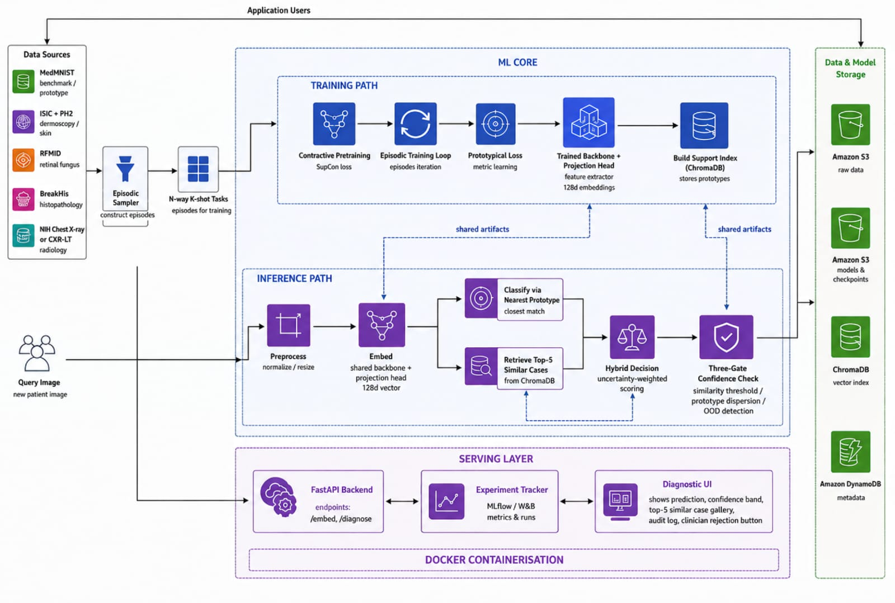
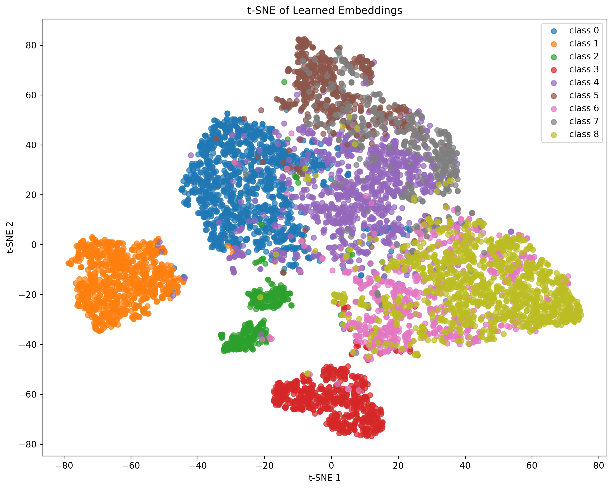

# Few-Shot Rare Disease Classification

## Brief Description
The Few-Shot Rare Disease Classification is a metric-learning system that learns a 128-Dimension medical-image embedding space using EfficientNet-B3 and episodic Prototypical Network training. It enables classification of novel/unseen disease classes from minimal labeled support examples. The system combines prototype-based classification with ChromaDB similarity retrieval, hybrid decision-making, uncertainty estimation, and continual learning using Fisher-based Elastic Weight Consolidation.

## Deliverables
1. Prototype-based few-shot learning model.
2. Medical image embedding generator.
3. Similarity-based retrieval engine.
4. Rare disease diagnostic support UI.

## Tools Used
1. Python - `PyTorch`, `timm`, `albumentations`, `ChromaDB`, `collections`, `tqdm`, `mlflow`, `FastAPI`, `numpy`, `pandas`, `matplotlib`
2. JavaScript - `React.js`

## Architecture Diagram


## How to Run
### With Docker
```sh
git clone <repo>
cd rare-disease-fsl
docker-compose up
```
And then open: `http://localhost:5173`

### Without Docker
1. Install Required Libraries: 
`pip install -r requirements.txt`
- Python Version: `3.12.2`
- Pip Version: `26.1.2`
- PyTorch Version: `2.13.0`

2. Data Setup:
- Run `setup_pathmnist.py`, download ISIC dataser, run `setup_isic.py`
- Include the exact download URL for ISIC in `.env`.

3. Training (Optional, since the best models are saved at `models/`):
- Run `python src/training/train.py`
- Alter backbone in `train.py` as needed. Options are: 'resnet18', 'efficientnet_b3'

4. Index Building:
- Run `python src/retrieval/index_builder.py` immediately after training.

5. Running the API:
- Run `uvicorn api.main:app --reload`

6. Running the UI:

7. Running mlflow:
- Run `mlflow ui --port 5000`

## Project Structure

```text
few-shot-rare-disease-classification/
├── data/
│   ├── isic/                   -> original ISIC dataset
│   ├── processed/              
│   │   ├── splits/             -> json files with base/novel splits for PathMNIST & ISIC
│   │   ├── support_images/     -> class-wise support images for PathMNIST
│   └── ...
│
├── models/                     -> trained model checkpoints, continual-learning artifacts, t-sne plot image
│
├── src/                        -> core of the model & features
│   ├── data/                   
│   │   ├── datasets.py         -> dataset loading
│   │   ├── augmentations.py    -> preprocessing, and augmentation
│   │   └── episodes.py         -> episodic sampling
│   │
│   ├── models/                 
│   │   └── embedding_generator.py -> embedding model and backbone architecture
│   │   └── proto_net.py        -> computing prototypes and prototypical loss
│   │
│   ├── retrieval/             
│   │   ├── index_builder.py    -> constructing prototypes
│   │   └── retrieval.py        -> similarity retrieval using ChromaDB
│   │
│   ├── training/                 
│   │   └── train.py            -> train the model on resnet/efficientnet
│   │   └── evaluate.py         -> utility function to compute accuracy & ci
│   │
│   ├── uncertainty/            
│   │   ├── confidence.py       -> confidence & uncertainity measurement + explainability
│   │   ├── mc_dropout.py       -> Monte Carlo dropout
│   │
│   └── continual/             
│       ├── fisher.py           
│       ├── ewc.py              -> EWC regularization for continual learning
│       └── replay_buffer.py
│
├── scripts/                    -> artifact generation scripts
│   ├── run_fisher.py
│   └── run_tsne.py
│
├── tests/                      unit and integration tests for each project component
│   ├── test_retrieval.py
│   ├── test_uncertainty.py
│   └── test_continual.py
│
├── requirements.txt            # python dependencies
└── README.md                   # project documentation
```
(more elaborate documentation found in respective folders with seperate READMEs)

## Results
### Few-Shot Classification

| Model | Method | Accuracy | Confidence |
|---|---:|---:|---:|
| resnet18 | 3-way 5-shot | 87.21% | 4.26% |
| resnet18 | 3-way 1-shot | 75.56% | 9.79% |
| efficientnet_b3 | 3-way 5-shot | 85.60% | 4.77% |
| efficientnet_b3 | 3-way 1-shot | 73.22% | 8.67% |

### Retrieval

| Metric | Score |
|---|---:|
| Precision@1 | 86.67% |
| Precision@3 | 82.22% |
| Precision@5 | 80.00% |

### Uncertainty & Continual Learning

| Component | Metric | Result |
|---|---|---:|
| MC Dropout | MC variance | 0.016235 |
| MC Dropout | Deterministic variance | < 1e-8 |
| EWC | Anchor penalty | 0.000000 |
| EWC | Perturbed penalty | 49.5772 |
| Fisher | Non-zero parameter fraction | 100% |

### t-SNE Plot


(Interpretations in Report)

## Features
### 1. Embedding Generator
- EfficientNet-B3 is used as the backbone with 1536 dimensions. Backbone initialized with ImageNet pretrained weights.
- Projection head consists of a 2-layer MLP: Linear -> ReLU -> Dropout -> Linear
- EfficientNet-B3 is preferred over alternatives - ResNet18, ViT, due to its smooth balance between representational capacity and computational cost & time. 
- Projection head compresses 1536 dimensions -> 128 dimensions to retain more representational capacity over smaller embeddings, enhance prototype computation, and ease distance based inference during retrieval.

### 2. Prototype Classification
- Classification is performed using a Prototypical Network rather than a conventional fixed-output classification head.
- For an `N`-way `K`-shot episode, `N` classes are sampled and `K` labeled support images are selected for each class. Additional query images are sampled from the same classes.
```text
Episode:
-> Support set: N × K images
-> Query set:   N × Q images
```
- Prototypes are computed for each class by sampling episodes, unfreezing the backbone, computing loss over 30 epochs, and computing accuracy. Each class has one associated prototype, which is the mean of its support embeddings.
- Trains the embedding space using negative log-likelihood loss, encouraging queries to move closer to their correct class prototype and farther from competing classes.

### 3. Similarity Based Retrieval Engine
- Uses ChromaDB to maintain separate vector collections for class prototypes and individual support-image embeddings.
- Retrieves the top-K most similar support images using the learned 128-D embedding space and computes a majority class vote.
- Combines prototype classification and retrieval through a hybrid decision layer. Agreement between both methods provides stronger evidence for the predicted class; disagreement is treated as an uncertainty signal indicating conflicting evidence.
- Priority is given to the prototype over retrieval.

### 4. Uncertainity Quantification & Confidence Measurement
- Computes the classification margin, measuring the separation between the highest and second-highest class scores.
- Uses a distance flag to identify query images whose nearest prototype is farther than a predefined threshold. If a query remains far away from every prototype, it forms its own cluster.
- Computes retrieval agreement by comparing the prototype prediction with the majority class among retrieved support images.
- Aggregates these signals into an overall uncertainty score with `HIGH, MODERATE, and LOW` confidence levels.
- Returns explicit uncertainty reasons, enhancing interpretability and explainability over raw confidence scores.

### 5. Continual Learning
- Uses Elastic Weight Consolidation (EWC) to reduce catastrophic forgetting when adapting the embedding model to new classes and examples.
- Estimates parameter importance using the diagonal Fisher Information Matrix, computed from episodic few-shot training objectives.
- Triggers fine-tuning only when the new-data requirement satisfies the configured `needs_finetuning` threshold.
- Maintains a per-class replay buffer containing a small set of representative support images.
- Uses embedding-space herding to select examples whose running mean remains close to the full class prototype, which preserves memories for future inference.

(Detailed description can be found in report.)

## Limitations
1. Novel class selection — Selection was done on frequency-based methods rather than visual-similarity-based (base 1, 2, 3, 5, 7, 8, novel 0, 4, 6). This inflates accuracy metrics for resnet18, but deflates it for efficientnet_b3. Accuracy is capped at ~85-87% for 3-way 5-shot and ~73-75% for 3-way 1-shot. Standard split (base 0–5, novel 6–8) is preferred for comparison with published baselines.

2. Low Maximum N-Way: Holding out only 3 novel classes reduces measurement scope to just 3-way X-shot. For 5-way measurements, 5 novel classes are to be held out, and model weights re-trained to avoid leakage

3. SupCon Pretraining - Templates created, but SupCon pretraining was skipped due to excessive computation requirements that are unsupportable (1 epoch = 15h training time).

## Future Improvements
1. SupCon Pretraining & Retraining with 5 Novel classes.
- Supervised Contrastive Learning is used to pull embeddings from the same disease class closer together while pushing embeddings from different classes farther apart. Given extra GPU-resources, and compute time, SupCon Pretraining can boost accuracy by 5-10%
- Re-training resnet18, efficientnet_b3, and this time, even ViT, on the standard novel classes for more appropriate comparison, and identifying expected accuracy gaps, i.e, efficientnet outperforming resnet.

2. Cross-Modality
- Incorporating wrappers, transformers and additional pipelines for Dermoscopy, Chest X-rays, and Retinal Fungus.
- Investigate whether a shared embedding space can learn representations that generalize across modalities despite differences in image appearance and acquisition.
- Compare single-modality vs. cross-modality training to determine whether knowledge from one modality improves few-shot performance in another.

3. Explainability using Grad-CAM, SHAP, and VLMs.
- Add Grad-CAM visualizations to identify image regions contributing most strongly to the CNN's learned representation or prediction.
- Use SHAP to quantify feature-level contributions and provide a complementary attribution-based explanation of model outputs.
- Integrate Vision-Language Models (VLMs) to generate natural-language descriptions of relevant visual patterns and contextualize retrieved examples.

4. Latency Improvements for Production-Grade Systems.
- Profile the complete inference pipeline to identify bottlenecks across image preprocessing, embedding generation, ChromaDB retrieval, prototype classification, and uncertainty computation.
- Cache class prototypes and avoid recomputing embeddings or prototype representations that remain unchanged between requests.
- Tune ChromaDB indexing and retrieval parameters to balance Precision@K against retrieval latency.
- Establish production metrics such as p50/p95/p99 latency, throughput, memory usage, and retrieval time, rather than evaluating the system only on model accuracy.